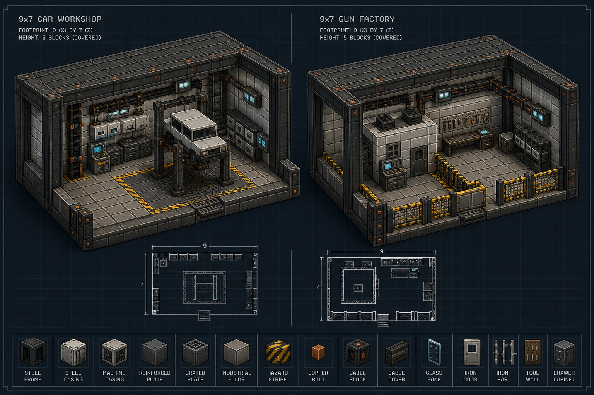

# Workshop Architecture Review



The render is the approved visual target. Its material strip is represented by
independently craftable/placeable pack blocks: steel frame/casing, machine
casing, reinforced and grated plate, industrial floor, hazard stripe, cable
block/cover, reinforced glass, tool wall and drawer cabinet. Runtime placement
uses the same registered components available to players.

## Shared envelope

- Footprint: 9 × 7 blocks centered on the controller.
- Clear height: four blocks above the floor; the containing building supplies
  a roof. Rain reaching the controller causes rust and stops production.
- Access: the positive-Z center lane stays clear.
- Power: the controller is the EU sink; surrounding equipment is a visual set
  piece and does not create hidden inventories or free materials.
- Protection: deployment fills missing floor and empty equipment positions; it
  does not intentionally replace solid player construction.

## Exact placement key

The controller is `C` at `(0,0,0)`. `F` is the iron safety floor one block
below; `G` is the three-block-high side gantry; `R` is the height-three roof
rail; `L` is a redstone lamp at height three; `B` is a functional-looking side
bench. Coordinates are relative to the controller.

```text
Top rail / equipment plan (z = -3 at top)

G R R R R R R R G
G . . . . . . . G
G B . . . . . . G
G B . L C L . . G
G B . . . . . . G
G B . . . . . . G
G R R R R R R R G

x = -4 ........ +4
```

The Car Workshop uses iron framing and anvil lift/bench stations. The Gun
Factory uses stone-brick framing, weighted-plate machining stations and a
clear guarded assembly bay. The architecture deliberately communicates that
advanced vehicles and firearms are factory products rather than workbench
recipes.

## Review deltas still to implement

- Replace the symbolic anvil/pressure-plate stations with dedicated lift and
  enclosed-machining models.
- Add orientation-aware placement; the current set piece uses world axes.
- Add a preflight ghost preview and explicit obstruction report before the
  controller is committed.

The raster review image was generated with the built-in image generation tool
from a voxel-isometric, IC2-adjacent architecture prompt. Exact runtime truth
is the coordinate contract above and `WorkshopSystem.java`.
